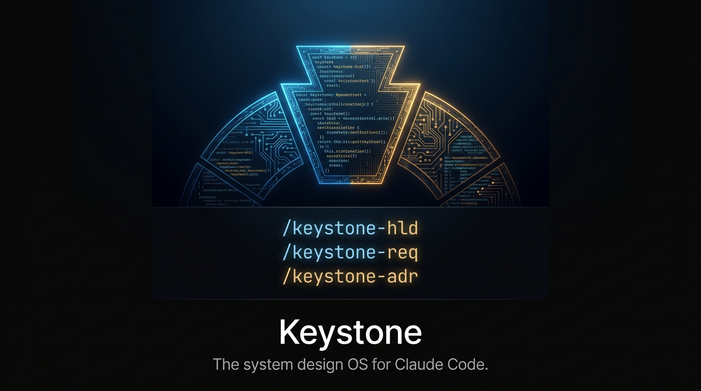

# Keystone


The system design operating system for Claude Code.

## Installation

### Cross-Platform Setup

Keystone supports multiple platforms and host CLIs (Claude Code, Kilo Code, Gemini CLI).

#### Windows (PowerShell)
```powershell
# OSS tier — one-line global install
git clone --depth 1 https://github.com/singularrarity/keystone.git $env:USERPROFILE\.claude\skills\keystone
cd $env:USERPROFILE\.claude\skills\keystone
.\setup.ps1

# Pro tier — add private skills on top
git clone https://github.com/singularrarity/keystone-pro.git $env:USERPROFILE\.claude\skills\keystone-pro
cd $env:USERPROFILE\.claude\skills\keystone-pro
.\setup-pro.ps1
```

Or use the batch files:
```cmd
# Double-click setup.bat or run:
setup.bat
```

#### Unix/Linux/macOS (Bash)
```bash
# OSS tier — one-line global install
git clone --depth 1 https://github.com/singularrarity/keystone.git ~/.claude/skills/keystone \
  && cd ~/.claude/skills/keystone && ./setup

# Pro tier — add private skills on top
git clone https://github.com/singularrarity/keystone-pro.git ~/.claude/skills/keystone-pro \
  && cd ~/.claude/skills/keystone-pro && ./setup-pro
```

## Demo

> `/keystone-run` on a real-time payments platform — requirements, 
> estimation, architecture diagram, and ADR in one session.

[](https://youtu.be/_OKl3gJK2ZQ)

*Click to watch the full 10-minute demo on YouTube.*

## Usage

Run `/keystone-req --help` to get started.

## License

MIT