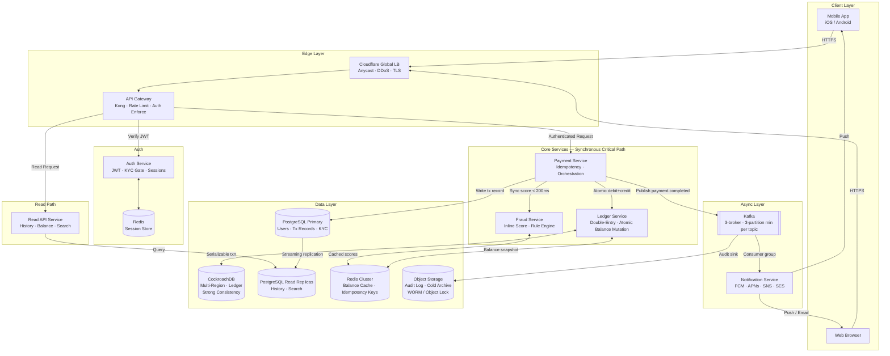

# Real-Time Payments Platform — High-Level Design

> Constraints: 10K TPS peak, strong consistency on balances, eventual consistency on notifications, global users.

## Architecture Decision: Monolith vs Microservices

**Decision: Microservices.** The payment, ledger, fraud, and notification domains are orthogonally scaled — ledger writes need strong consistency isolation, fraud scoring has a hard 200ms latency budget, and notifications are purely async. Coupling these into a monolith would force the slowest SLA (notification delivery) to share a deployment boundary with the most critical path (ledger commit). Team size threshold (>5 engineers) and the 10K TPS requirement also justify the operational overhead.

---

## Component Table

| Component | Responsibility | Technology | Why Not Alternative |
|---|---|---|---|
| Global Load Balancer | Geo-routing, DDoS, TLS termination | Cloudflare / AWS Global Accelerator | Single-region ALB: adds 80–150ms RTT for non-local users; no anycast routing |
| API Gateway | Auth enforcement, rate limiting, request routing | Kong (self-hosted) | AWS API GW: 29ms added latency per hop, 10K TPS limit on managed tier, cost at scale prohibitive |
| Auth Service | JWT issuance, KYC gate, session management | Custom Go service + Redis | Keycloak: JVM startup overhead + complex clustering; Firebase Auth: vendor lock-in, no on-prem for compliance |
| Payment Service | Idempotency, orchestration, transaction lifecycle | Go | Node.js: event loop bottleneck under sustained CPU load at 10K TPS; Java: acceptable but higher memory footprint |
| Fraud Service | Inline risk scoring, rule engine + ML | Python (FastAPI) + Redis score cache | External vendor (Sardine, Sift): 50–150ms added network RTT blows 200ms budget; no model ownership |
| Ledger Service | Double-entry bookkeeping, atomic balance mutations | Go + CockroachDB | PostgreSQL single-primary: serializable isolation at 10K TPS requires global coordination unavailable in single-region Postgres |
| Event Bus | Async decoupling, event replay, audit stream | Apache Kafka (3-broker cluster) | RabbitMQ: messages dropped after ACK, no replay for audit; SQS: no consumer group semantics, weaker ordering guarantees |
| Notification Service | Push (FCM/APNs), SMS (SNS), email (SES) delivery | Go consumer group on Kafka | Sync delivery on payment path: notification latency (~3s p95) would block payment acknowledgement |
| Read API Service | Transaction history, balance reads, search | Go + PostgreSQL read replicas | Same service as write path: read scalability is independent; co-location forces joint deploys |
| Cache | Balance snapshots, idempotency keys, sessions | Redis Cluster (6 nodes, 3 primary + 3 replica) | Memcached: no atomic `INCR`/`DECR` needed for balance pre-checks; no persistence for idempotency key TTLs |
| Ledger DB | Global strong consistency, ACID transactions | CockroachDB (multi-region) | Google Spanner: GCP lock-in, no self-hosted option for regulated on-prem deployments; CockroachDB is Spanner-equivalent |
| Transactional DB | User profiles, transaction records, KYC state | PostgreSQL 16 (per-region, streaming replication) | MongoDB: financial schema is relational; schemaless format creates auditability risk and query performance unpredictability |
| Object Storage | Immutable audit log, cold-tier archive (7yr) | S3 / GCS with Object Lock | RDBMS for archive: cost-prohibitive at 29TB/year; object lock provides WORM compliance natively |
| Observability | Distributed tracing, metrics, log aggregation | OpenTelemetry → Grafana stack (Tempo, Loki, Mimir) | Datadog: $400K+/yr at this scale; vendor lock-in on trace format |

---

## System Diagram



---

## Critical Data Flows

### 1. Send Payment (MUST)

```
User (POST /payments)
  → Cloudflare GLB
  → API Gateway [rate-limit check, JWT verify]
  → Auth Service [validate KYC status]
  → Payment Service [generate idempotency key, check Redis for duplicate]
  → Fraud Service [sync score, < 200ms hard timeout → allow/deny]
  → Ledger Service [CockroachDB serializable txn: debit sender, credit receiver atomically]
  → PostgreSQL [write transaction record]
  → Kafka [publish payment.completed event]
  → 200 OK to user [< 500ms p99]

Async (off critical path):
  Kafka → Notification Service → FCM/APNs (sender + receiver push) [< 3s p95]
  Kafka → Object Storage [append audit log entry]
```

**Sync/async split:** Ledger commit is synchronous — user must know if funds moved. Notifications are async — delivery delay does not affect payment correctness.

[RISK: HIGH] Fraud service timeout: if fraud scoring exceeds 200ms hard timeout, Payment Service must either fail-open (allow with async review flag) or fail-closed (deny). Decision must be explicit in config — undefined behavior here is a regulatory and fraud exposure. Default: **fail-closed** until risk team defines rules.

---

### 2. View Transaction History (MUST)

```
User (GET /transactions?page=N&limit=20)
  → API Gateway [JWT verify]
  → Read API Service
  → PostgreSQL Read Replica [paginated query by user_id + created_at index]
  → 200 OK [< 100ms p99 for cached hot users]
```

**Sync.** Read replicas lag < 1s from primary; this is acceptable for history display (user is not making a financial decision on stale history).

[RISK: LOW] Replica lag during high write bursts could show stale last transaction. Mitigation: read-your-own-writes token (write a version tag to Redis on payment commit; read API checks tag and falls back to primary if replica is behind).

---

### 3. Incoming Payment Notification (MUST)

```
Kafka [payment.completed event]
  → Notification Service [consumer group, at-least-once delivery]
  → Device token lookup (Redis/PG)
  → FCM / APNs push
  → SNS SMS (fallback if push undelivered after 30s)
  → SES email (secondary receipt)
```

**Async.** Notification failure must NOT roll back the payment — the ledger commit is the source of truth.

[RISK: MED] FCM/APNs delivery is not guaranteed (device offline, token expired). Mitigation: store notification state in PostgreSQL; expose `/notifications/unread` endpoint so mobile app pulls on foreground resume. This hybrid push+pull pattern ensures delivery completeness.

---

### 4. Admin Freeze Account (MUST)

```
Admin (POST /admin/users/{id}/freeze)
  → API Gateway [admin JWT, elevated scope claim]
  → Auth Service [write freeze flag to PostgreSQL + Redis session store]
  → Redis [invalidate all active sessions for user_id]
  → Kafka [publish account.frozen event]
  → Payment Service [subscribes: rejects in-flight payments for frozen user_id]
```

**Sync write to Redis (session invalidation), async propagation to services.** In-flight payments in the 0–500ms window may complete before freeze propagates — acceptable; Ledger Service performs a final account-status check at commit time as a hard gate.

---

## Deployment Model

| Concern | Decision | Justification |
|---|---|---|
| Topology | Multi-region active-active (read) + active-passive (ledger write) at launch; full active-active at Year 3 | CockroachDB supports multi-region write with configurable leaseholder placement; start with single home region for ledger to avoid cross-region write latency penalty (~60–120ms) |
| Regions at launch | 3 regions: us-east-1, eu-west-1, ap-southeast-1 | Covers Americas, Europe, Asia-Pacific; satisfies GDPR data residency with eu-west-1 isolation |
| Container orchestration | Kubernetes (EKS / GKE) | Self-managed k8s overhead too high; managed plane reduces ops burden; Helm charts for reproducible deploys |
| Service mesh | Istio (mTLS between services) | All inter-service traffic encrypted and observable; sidecar latency overhead (~1–2ms) acceptable vs. security gain |
| CI/CD | GitOps (ArgoCD) + canary deployments | Payment service changes deployed to 5% traffic first; automatic rollback on p99 latency regression |
| Secrets management | HashiCorp Vault | AWS Secrets Manager: acceptable alternative but Vault is cloud-agnostic; avoids lock-in for multi-cloud compliance |
| Disaster recovery | RPO = 0 (CockroachDB sync replication); RTO < 30s (k8s pod restart + LB failover) | Financial data: zero data loss non-negotiable; 30s RTO meets 99.95% availability SLA |
| Compliance boundary | EU user data pinned to eu-west-1 via CockroachDB regional table partitioning | GDPR Art. 44: data must not leave EU without adequacy decision; CockroachDB `REGIONAL BY ROW` enforces this at the DB layer |

[ASSUMPTION] Single home region (us-east-1) acts as ledger leaseholder at launch; cross-region writes from EU/APAC incur 60–120ms extra latency on the payment path. This is acceptable until DAU > 15M per region, at which point per-region leaseholder promotion is warranted.

[RISK: HIGH] CockroachDB multi-region operational complexity: split-brain scenarios during network partition require automatic leaseholder re-election. Mitigation: deploy odd number of nodes (5 minimum) per region for quorum; set `zone_survivability_goal = regional` in cluster config; conduct chaos testing (Chaos Monkey / Gremlin) before production launch.

[RISK: MED] Kafka as single event bus is a shared-fate component: if Kafka cluster degrades, notifications and audit logging fail together. Mitigation: separate Kafka clusters for (a) critical payment events and (b) non-critical notification/analytics events; payment cluster runs on higher-spec brokers with stricter replication factor (RF=3, min.insync.replicas=2).
